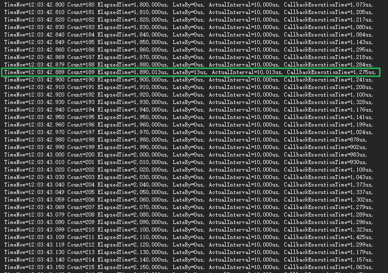
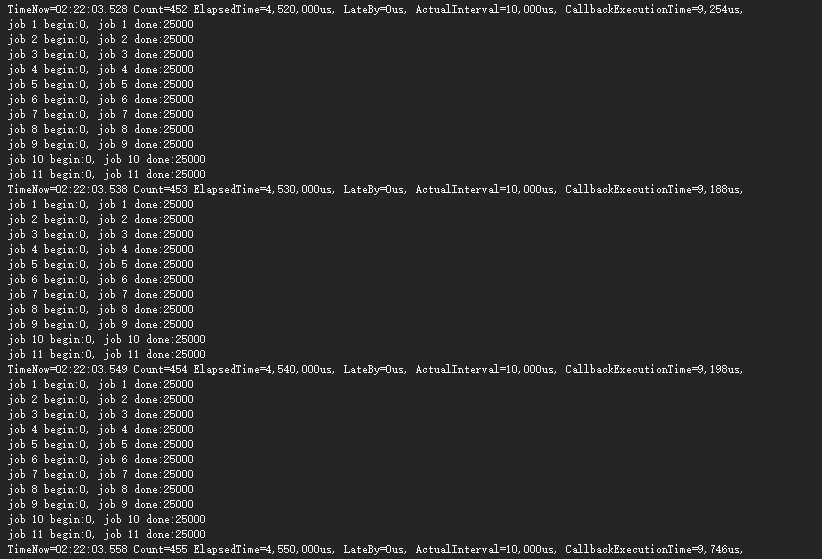

# LoongEgg.Timer

> Hight accurate timer of c# on windows, in my computer the resolution is micro seconds(us) of a 100Hz(10ms) timer
>
> 高精度CSharp定时器 在我的电脑上开启的100Hz计时可以保证10个任务各2W次的运算发生的计时器延迟在us级别 总任务延迟不超过10ms


## Performance





## HowTo
- 参考项目中的代码
- Or refer to the following code

```cs
using System;
using System.Diagnostics;
using System.Threading;

namespace LoongEgg.Timer.Demo
{
    class Program
    {
        static void Main(string[] args)
        {
            var timer = new MicroTimer(10000);
            timer.Elapsed += (s, e) => Timer_ElapsedMockJob(1);
            timer.Elapsed += (s, e) => Timer_ElapsedMockJob(2);
            timer.Elapsed += (s, e) => Timer_ElapsedMockJob(3);
            timer.Elapsed += (s, e) => Timer_ElapsedMockJob(4);
            timer.Elapsed += (s, e) => Timer_ElapsedMockJob(5);
            timer.Elapsed += (s, e) => Timer_ElapsedMockJob(6);
            timer.Elapsed += (s, e) => Timer_ElapsedMockJob(7);
            timer.Elapsed += (s, e) => Timer_ElapsedMockJob(8);
            timer.Elapsed += (s, e) => Timer_ElapsedMockJob(9);
            timer.Elapsed += (s, e) => Timer_ElapsedMockJob(10);
            timer.Elapsed += (s, e) => Timer_ElapsedMockJob(11); 
            timer.Elapsed += Timer_Elapsed;
            timer.Enabled = true;

            Thread.Sleep(5000);
            timer.Enabled = false;

            Debugger.Break();
        }

        private static void Timer_Elapsed(object sender, MicroTimerEventArgs args)
        {
            Debug.WriteLine($"TimeNow={DateTime.Now.ToString("hh:mm:ss.fff")} "
                             + $"Count={args.TimerCount.ToString("#,0")} "
                             + $"ElapsedTime={args.ElapsedMicroSeconds.ToString("#,0")}us, "
                             + $"LateBy={args.TimerLateBy.ToString("#,0")}us, "
                             + $"ActualInterval={args.ActualInterval.ToString("#,0")}us, "
                             + $"CallbackExecutionTime={args.CallbackFunctionExecutionTime.ToString("#,0")}us, ");
        }

        private static void Timer_ElapsedMockJob(int id)
        {

            int count = 0;
            Debug.Write($"job {id} begin:{count}, ");
            for (count = 0; count < 25000; count++)
            {

            }
            Debug.WriteLine($"job {id} done:{count}");
        }

    }
}

```

